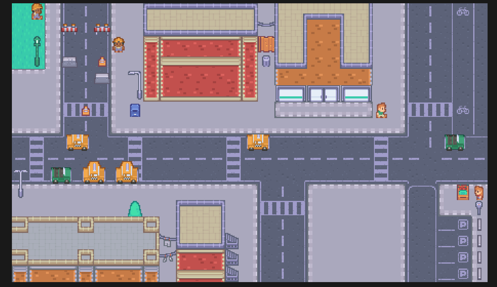

# Forge

This is a custom-built game engine designed with flexibility and future expansion in mind. Below are some of its key features and future development plans.

## Showcase


## Cloning the Repository
To get started with the engine, clone the repository recursively as follows:

```bash
git clone --recursive https://github.com/TanyaSravan/Forge
```

## Getting Started
After cloning the repo, follow these steps:
- Navigate to the scripts folder.
- Run the Win-GenerateProjects.bat file to generate the necessary project files.
- Open the generated solution in Visual Studio (or your preferred IDE).
- Build the solution to compile the engine.

## Features
- **Event System**: Efficient handling of events such as user inputs and window actions.
- **Input System**: Manage user input from various devices like keyboards and mice.
- **2D Renderer**: Includes **batch rendering** for performance improvements when rendering multiple objects.
- **ImGui**: Integrated for user-friendly UI development and debugging.
- **OpenGL**: Currently, the engine uses OpenGL as its graphics API and is **Windows-compatible** only.

## Future Plans
- **3D Rendering**: Expanding the engine to support 3D graphics.
- **Vulkan Support**: Adding Vulkan as an additional graphics API option.
- **Cross-Platform Compatibility**: In the future, the engine will support platforms beyond Windows.


